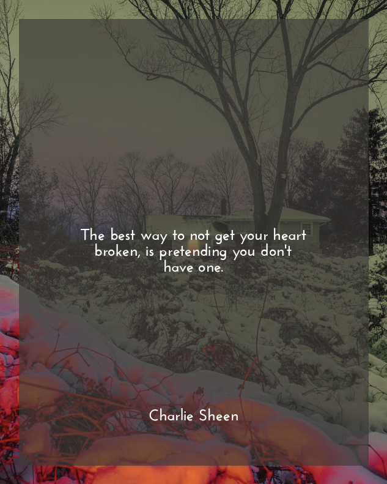

# Insta Sad Aesthetic Quote Generator

## Why

I was going through a phase of self induced sadness, and endlessly scroll through sad
and depressing quotes with aesthetic images on instagram. It was such a waste of time,
so I decided to make my own bot to make other people feel sad.

## How 

- Image backgrounds are sourced from tumblr blog like [this](https://queenmoriarty.tumblr.com/)
- Quotes are scrapped from goodreads having specific tags like [sad](https://www.goodreads.com/quotes/tag/sad) or [depressing](https://www.goodreads.com/quotes/tag/depressing)
- Instagram posts are generated using [pillow](https://pillow.readthedocs.io/en/stable/index.html) and posted using [instabot](https://instagrambot.github.io/docs/en/)
- I have a cronjob set which posts new image quotes every 69*2 = 138 mins.

## TODO

- refactoring
- using a db instead of json

(PS:For educational purpose only)
